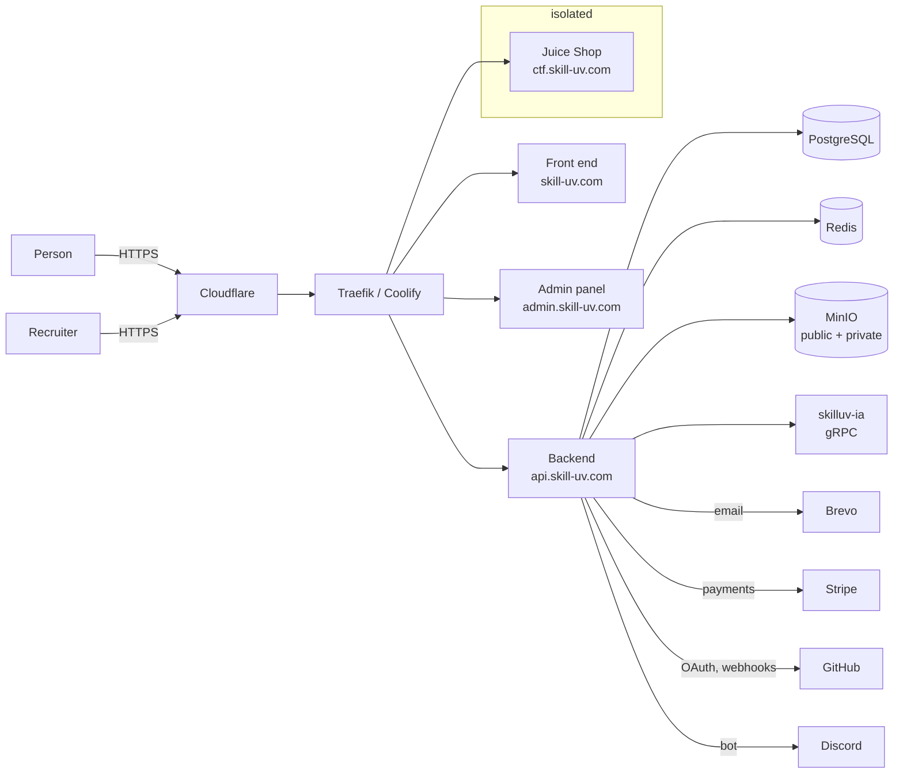

# Threat model

What Skilluv is worth attacking for, who would, what stops them today, and what
does not. Published so that it can be argued with — and it is an audit exercise
in the security catalogue, because a threat model nobody has attacked is a
threat model nobody has checked.

**Status: written by the people who built the platform. Unreviewed externally.**
The most useful contribution to this document is a threat it does not consider.

---

## The system

`ctf.skill-uv.com` is deliberately vulnerable and sits on its own Docker network
with no route to anything else. That isolation is the single most important line
in this diagram: an exploit in the range must not be a shell on the platform.

## What is worth taking

Ranked by what an attacker would actually want, which is not the same as by
volume.

| Asset | Why somebody wants it | Where it is |
|---|---|---|
| **Unpublished findings** | Working exploits against live systems, including systems belonging to other people | `security_findings`, proof files in the private bucket |
| **Identity documents** | Fraud, and the most sensitive personal data here | Private object store |
| **Session tokens and password hashes** | Account takeover, credential stuffing elsewhere | `user_sessions`, `users` |
| **OAuth and payment tokens** | Access to somebody's GitHub, or their money | `github_connections`, Stripe customer records |
| **The attestation record** | Forging a proof is forging a career | `attestations`, `deliverables` |
| **Email addresses** | A list of security-minded developers is a phishing list | `users` |

The first row is specific to this domain and is the one that changes the threat
model. Before the disclosure programme, the worst outcome of a breach here was
somebody's account. Now it includes somebody else's unpatched vulnerability.

## Who

**A script kiddie or an automated scanner.** Constant, low skill, no
specific interest. Mitigated by the ordinary controls and by the range, which is
where a lot of that traffic goes on purpose.

**A researcher who exceeds the scope.** Not malicious, and the most likely
source of a real incident: somebody testing enthusiastically who runs a load
test, or pivots, or takes a whole table to prove a read. Mitigated by the scope,
the research token's ceiling and the volume rule — and by the safe harbour,
which is what makes them tell us instead of going quiet.

**Somebody after the findings.** Skilled, specific, and the threat this platform
created for itself. Wants the private bucket or the `security_findings` table.

**A competitor or a scraper.** Wants the talent data. Mitigated by rate limits,
by API keys with metering, and by the public profile being a choice.

**A malicious contributor.** Has an account, submits work, and is inside the
first ring. Mitigated by review, by plagiarism scanning, and by the fact that a
capability is granted rather than claimed.

**A malicious insider.** Has an administrator capability. Mitigated by the audit
log and by nothing else, honestly, at a team of three.

**A state actor.** Out of scope. If one is interested in this platform,
something has gone strangely right.

## Threats, by category

STRIDE, and only the entries where the answer is interesting.

### Spoofing

| Threat | Today |
|---|---|
| Credential stuffing | Argon2id, rate limits on auth, WebAuthn available |
| Session theft | Short-lived JWT, refresh tokens hashed in the database, secure cookies |
| Forged attestation | Verification codes are random 50-bit values checked server-side; an attestation links the deliverable it rests on |
| **An administrator without a second factor** | Refused at the gate — `AdminTwoFaSetupRequired` |

### Tampering

| Threat | Today |
|---|---|
| Cross-site request forgery | Double-submit cookie on state-changing routes |
| Supply chain | `cargo-deny`, Trivy, gitleaks, CodeQL, signed images, SLSA provenance |
| **A finding altered after confirmation** | `security_finding_events` is append-only; the reported severity is kept alongside any override |
| **A flag or lab answer read from the database** | Only hashes are stored. A dump does not hand anybody the answers |

### Repudiation

| Threat | Today |
|---|---|
| "I never agreed to that NDA" | The signature records the SHA-256 of the exact text shown |
| "I did not change that severity" | Recorded with the actor and the reason, both required |
| "That review never happened" | `review_grid_scores` with the reviewer's id |

### Information disclosure

| Threat | Today |
|---|---|
| **A proof file leaking** | Private bucket, one-hour signed links, four roles, and a sweep that deletes orphans |
| **An embargo leaking through a listing** | The public card of a confirmed finding withholds the title and the reproduction until publication |
| IDOR on somebody else's work | Capability checks and ownership checks per route; the class most worth hunting |
| Identity documents | Private bucket, KYC reviewer capability |
| Error messages | Structured errors; stack traces are not returned |

### Denial of service

| Threat | Today |
|---|---|
| Layer 7 flooding | Cloudflare, then the Redis rate limiter |
| **A researcher's load test** | Out of scope in the policy, and the research token multiplies the ceiling rather than removing it |
| Expensive queries | Cursor pagination, caps on listing sizes |
| A large upload | Twenty megabytes per proof, and size read back from the store rather than trusted |

### Elevation of privilege

| Threat | Today |
|---|---|
| Granting yourself a capability | Capabilities are granted by an administrator or derived by a documented engine; there is no self-grant route |
| **A triager confirming a finding** | Refused by the transition table, not by a convention |
| **A reviewer publishing one** | Refused likewise — publication is administrator-only |
| Escape from the range | Dedicated network, no route inward, no secrets in its environment |
| Tenant crossing | Row-level security, enforced when `SKILLUV_RLS_ENFORCED=1` |

## What is not mitigated

Said plainly, because a threat model that only lists wins is marketing.

**A compromised maintainer workstation.** Whoever owns the laptop owns the
deploys. Mitigated by signed images and branch protection to the extent that
those help, which is not much against somebody with the developer's session.

**A malicious administrator.** The audit log records it and nothing prevents it.
At three people this is a trust problem rather than a technical one, and pretending
otherwise would be worse.

**Insider access at the hosting provider.** Assumed away. Data is not encrypted
at rest in a way that would survive it.

**A zero-day in PostgreSQL, Redis or the Docker engine.** Patched within a day
of an upstream fix, which is a response and not a mitigation.

**Runtime intrusion detection.** There is none — no Falco, no eBPF monitoring.
At this scale it would produce alerts nobody reads. This is a deliberate
acceptance and it is the one most likely to be wrong first.

**Correlation of a researcher's activity.** Traffic under a research token is
logged with the person's identity. Somebody who reads those logs learns what
that researcher was probing before they filed anything. Access is limited to
administrators; nothing else protects it.

## What would change the model

- **Money moving through the platform.** Adds fraud as a motive and regulators
  as a stakeholder.
- **A second administrator who is not a founder.** Makes the insider threat
  technical rather than social, and makes the audit log load-bearing.
- **Ten thousand accounts.** Makes the email list worth phishing and makes
  denial of service worth doing.
- **A client engagement on somebody else's production system.** Puts a third
  party's data inside the blast radius of a Skilluv breach. This is the one to
  think hardest about before the first paid mission.

## How to contribute to this document

Read it against the code and report what it misses:
`POST /api/security/reports`, or take the audit exercise in the catalogue. A
threat this model does not consider, with the path that reaches it, is a finding
in the same sense as an injection.

The most valuable contribution is not a new mitigation. It is a mitigation
claimed here that the code does not actually implement.
